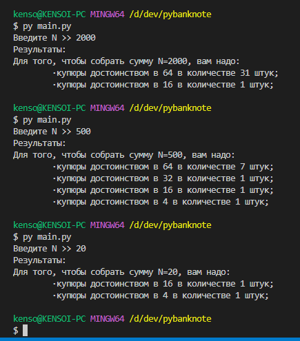

# PyBanknote
*Автор программы* - Прокофьев А.А. 
*Академическая группа* - Фт-210008

## Краткое описание программы:
В некоторой стране используются денежные купюры достоинством в 1, 2, 4, 8, 16, 32 и 64. Дано натуральное число N. Как наименьшим количеством таких денежных купюр можно выплатить сумму n (указать количество каждой из используемых для выплаты купюр)? (см TASK.md)

## Инструкции по использованию
Для запуска программы требуется установить Python версии 3.7 и выше  

### Установка через Git:
```bash
git clone https://github.com/kensoidev/pybanknote.git
cd pybanknote
```

### Запуск программы:
```bash
py main.py
```

### Примеры работы:
